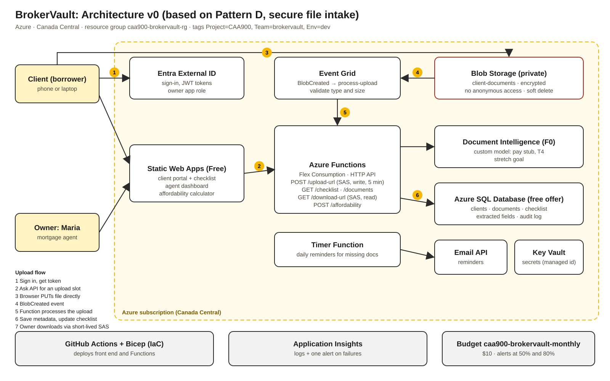

# BrokerVault — CAA900 Team BrokerVault

A secure document portal for an independent mortgage agent and their borrowers.

## Team

| Name | GitHub | Owns |
|---|---|---|
| Xinmeng Yuan | CrystalYuanxm | Everything: front end, backend and database, cloud setup and security, CI/CD pipeline |

## OPC persona

**Maria Chen** is an independent, FSRA-licensed mortgage agent in Toronto. She works alone from a home office and closes about 40 mortgages a year. She is paid commission by the lenders she places clients with.

**How she works today:** Clients send pay stubs, T4s, notices of assessment, bank statements, ID and employment letters by email, text and WhatsApp. Maria saves them into Google Drive folders and tracks what is missing in an Excel checklist, one row per client. She chases missing documents by phone.

## Pain point (in the owner's words)

> "Every client has to send me ten or more documents, and they come in by email, text, WhatsApp, whatever. I never know who is still missing what, I spend hours chasing people, and honestly I'm nervous about bank statements and SINs sitting in my email."

## User roles

1. **Owner (mortgage agent):** sees every client's file, the checklist status, and downloads documents to submit to lenders.
2. **Client (borrower):** logs in, sees their own checklist, and uploads documents securely.

## Solution (one sentence)

BrokerVault is a secure client portal where borrowers upload their mortgage documents and see exactly what is still missing, while the agent sees every client's progress on one dashboard.

## Success measure

- Time to collect a complete document package drops from **about 14 days to 3 days or less**.
- **Zero** confidential documents sent to the agent by plain email.

## Platform

**Microsoft Azure** (Seneca-provided subscription), region **Canada Central**, so client financial data stays in Canada. Cost control: 10 USD monthly budget with email alerts at 50% and 80%.

## Key features

1. **Client portal:** borrowers upload documents to a private container and see their own checklist (received or missing).
2. **Agent dashboard:** Maria sees every client's progress and sends reminders for missing documents.
3. **Affordability review (`calculator.html`):** while reviewing a client's documents, Maria enters the verified figures (income from T4, NOA or pay stub; debts from the credit report; down payment from bank statements) and gets the maximum purchase price, CMHC premium, monthly payment, and GDS/TDS at the stress-test rate. Rules: GDS 39% or less, TDS 44% or less, qualifying rate = max(contract + 2%, 5.25%), CMHC down-payment tiers, $1.5M insured cap. Agent-only page, because it shows confidential data.

## Cloud resources (so far)

| Resource | Name | Region | Notes |
|---|---|---|---|
| Resource group | `caa900-brokervault-rg` | Canada Central | Holds all dev resources; tags Project=CAA900, Team=brokervault, Env=dev |
| Storage account | `caa900brokervaultup` | Canada Central | Standard, LRS, Hot tier, anonymous access disabled |
| Blob container | `client-documents` | — | Private; holds client uploads |
| Budget | `caa900-brokervault-monthly` | — | 10 USD/month, email alerts at 50% and 80% |

## Architecture

Architecture v0 is based on reference **Pattern D (secure file intake)**: see `docs/architecture-v0.png` and Progress Submission 1.

## Why it needs the cloud

- Secure, encrypted storage for confidential financial documents, with private access only
- Clients upload from anywhere, at any time, from a phone
- Pay-per-use cost that fits a one-person business, with no server to maintain
